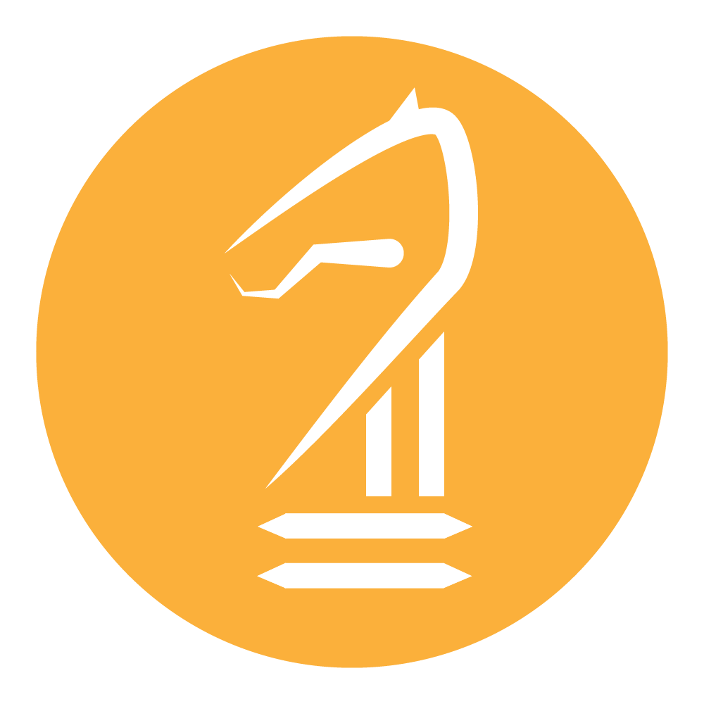
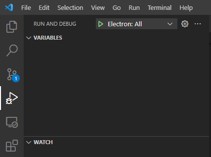

<p align="center">
  
</p>

<h1 align="center">
  <br />
  GoodKnight
</h1>

<h3 align="center">
Chess Database and Analysis Software
</h3>
<hr>

GoodKnight is an open source project that acts as a chess database manager and analysis tool. It's goal is to provide the powerful functionality of ChessBase or SCID except with a more modern and friendly user interface. 

Electron is used to make the desktop application, with React being the framework used in the frontend. Almost everything is programmed in TypeScript, and [antd](https://ant.design/) is used for UI components.  

## Setup

1. Clone repository to your local machine. 
2. Install npm dependencies: 

```
$ npm install
```

## Debugging

1. Run the following command. This compiles the project as well as starts a webpack dev server to enable auto reloading. 

```
$ npm run dev:react
```

2. Go to the debug tab of VSCode and click on the green arrow next to the run Electron: All button. 



Alternatively you can run the following, although you won't get any of the further debugging capabilities: 

```
$ npm run start:electron
```

3. Set breakpoints. The two debug profiles should handle both renderer and main processes, so you should be able to set breakpoints for either one. 